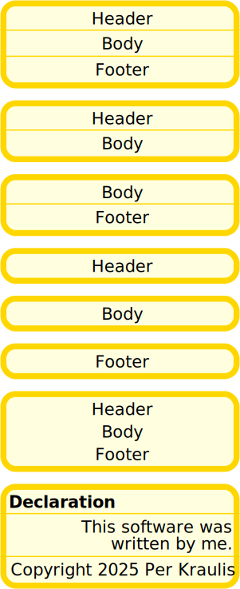

# board

- [Specification](#specification)
- [Examples](#examples)
  - [poster](#poster)
  - [notes](#notes)

## Specification
 "Diagram to place diagrams at specified positions.
    Cannot be used in other diagrams.
    

- **title**: Title of the board.
    - *definition*: See [here](timelines.md)
- **entries**: Diagrams at specified positions.
  - *required*
  - *type*: sequence
  - *items*:
    - *type*: mapping
    - **x**: Absolute position in board. Zero at left.
      - *required*
      - *type*: float
      - *minimum*: 0
    - **y**: Absolute position in board. Zero at top.
      - *required*
      - *type*: float
      - *minimum*: 0
    - **scale**: Scaling of diagram.
      - *type*: float
      - *exclusiveMinimum*: 0
      - *default*: 1
    - **timelines**:
        - *definition*: See [here](column.md)
    - **piechart**:
        - *definition*: See [here](column.md)
    - **note**:
        - *definition*: See [here](column.md)
    - **column**:
        - *definition*: See [here](column.md)
    - **row**:
        - *definition*: See [here](column.md)
## Examples

### poster


```yaml
neogram: 0.8.2
board:
  title: Poster
  entries:
  - x: 250
    y: 10
    note:
      header: By Per Kraulis
      body: Ph.D.
      footer: Stockholm University
  - x: 0
    y: 100
    timelines:
      title:
        text: Universe
        bold: true
        color: blue
      entries:
      - event:
          label: Big Bang
          timeline: Universe
          color: red
          instant: -13787000000
      - period:
          label: Milky Way galaxy
          timeline: Universe
          color: navy
          begin:
            value: -7500000000
            low: -8500000000
          end: 0
          fuzzy: gradient
      - period:
          label: Earth
          color: lightgreen
          begin: -4567000000
          end: 0
      - event:
          label: Here
          timeline: markers
          instant:
            value: -12000000000
            error: 600000000
          marker: none
      - event:
          label: Circle
          timeline: markers
          color: cyan
          instant: -10000000000
          marker: circle
          placement: center
      - event:
          label: Ellipse
          timeline: markers
          color: blue
          instant: -8000000000
          placement: left
      - event:
          label: ''
          timeline: markers
          color: orange
          instant:
            value: -6000000000
            low: -6500000000
            high: -5000000000
          marker: square
      - event:
          label: Pyramid
          timeline: markers
          color: gold
          instant: -4000000000
          marker: pyramid
          placement: center
      - event:
          label: Triangle
          timeline: markers
          color: purple
          instant: -2000000000
          marker: triangle
  - x: 50
    y: 230
    timelines:
      title: Earth
      entries:
      - period:
          label: Earth
          begin: -4567000000
          end: 0
      - period:
          label: Archean
          color: wheat
          begin:
            value: -4000000000
            low: -4100000000
            high: -3950000000
          end:
            value: -2500000000
            error: 200000000
          fuzzy: gradient
      - event:
          label: LUCA?
          timeline: Unicellular
          instant: -4200000000
      - period:
          label: Unicellular organisms
          timeline: Unicellular
          begin:
            value: -3480000000
            low: -4200000000
          end: 0
          fuzzy: gradient
      - period:
          label: Eukaryotes
          begin: -1650000000
          end: 0
      - period:
          label: Engineers
          color: lightgray
          begin:
            value: -3300000000
            error: 200000000
          end: -1650000000
          fuzzy: wedge
      - period:
          label: Photosynthesis
          color: springgreen
          begin: -3400000000
          end: 0
      - period:
          label: Plants
          timeline: Photosynthesis
          color: green
          begin: -470000000
          end: 0
          placement: left
```
### notes



```yaml
neogram: 0.8.2
board:
  entries:
  - x: 0
    y: 0
    scale: 1.5
    column:
      entries:
      - note:
          header: Header
          body: Body
          footer: Footer
      - note:
          header: Header
          body: Body
      - note:
          body: Body
          footer: Footer
      - note:
          header: Header
      - note:
          body: Body
      - note:
          footer: Footer
      - note:
          header: Header
          body: Body
          footer: Footer
          line: 0
      - note:
          header:
            text: Declaration
            placement: left
            bold: true
          body:
            text: 'This software was

              written by me.'
            placement: right
          footer:
            text: Copyright 2025 Per Kraulis
            italic: true
```

