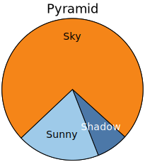
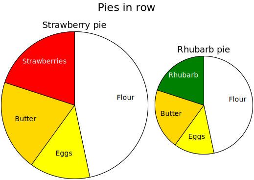

# piechart

## Examples

### pyramid



```yaml
neogram: 0.7.10
piechart:
  title: Pyramid
  entries:
  - slice:
      label: Shadow
      value: 7
  - slice:
      label: Sunny
      value: 18
  - slice:
      label: Sky
      value: 70
  start: 132
  palette:
  - '#4c78a8'
  - '#9ecae9'
  - '#f58518'
```
### day


```yaml
neogram: 0.7.10
piechart:
  title:
    text: Day
    size: 30
  entries:
  - slice:
      label: Sleep
      value: 8
      color: gray
  - slice:
      label: Breakfast
      value: 1
      color: lightgreen
  - slice:
      label: Gym
      value: 2
      color: lightblue
  - slice:
      label: Read
      value: 1
      color: navy
  - slice:
      label: Lunch
      value: 1
      color: lightgreen
  - slice:
      label: Shuteye
      value: 0.4
      color: gray
  - slice:
      label: Write
      value: 4.6
      color: pink
  - slice:
      label: Dinner
      value: 1
      color: lightgreen
  - slice:
      label: TV
      value: 3
      color: orange
  - slice:
      label: Read
      value: 2
      color: navy
  diameter: 400
  total: 24
```
### cpies


```yaml
neogram: 0.7.10
column:
  title: Pies in column
  entries:
  - piechart:
      title: Strawberry pie
      entries:
      - slice:
          label: Flour
          value: 7
          color: white
      - slice:
          label: Eggs
          value: 2
          color: yellow
      - slice:
          label: Butter
          value: 3
          color: gold
      - slice:
          label: Strawberries
          value: 3
          color: orangered
      diameter: 100
  - piechart:
      title: Rhubarb pie
      entries:
      - slice:
          label: Flour
          value: 7
          color: white
      - slice:
          label: Eggs
          value: 2
          color: yellow
      - slice:
          label: Butter
          value: 3
          color: gold
      - slice:
          label: Rhubarb
          value: 3
          color: green
```
### rpies



```yaml
neogram: 0.7.10
row:
  title: Pies in row
  entries:
  - piechart:
      title: Strawberry pie
      entries:
      - slice:
          label: Flour
          value: 7
      - slice:
          label: Eggs
          value: 2
      - slice:
          label: Butter
          value: 3
      - slice:
          label: Strawberries
          value: 3
      diameter: 300
      palette:
      - white
      - yellow
      - gold
      - red
  - piechart:
      title: Rhubarb pie
      entries:
      - slice:
          label: Flour
          value: 7
          color: white
      - slice:
          label: Eggs
          value: 2
          color: yellow
      - slice:
          label: Butter
          value: 3
          color: gold
      - slice:
          label: Rhubarb
          value: 3
          color: green
```
## Specification
Pie chart containing slices.

- **title**: Title of the pie chart diagram.
    - *definition*: See [here](timelines.md)
- **diameter**: Diameter of the pie chart, in pixels.
  - *type*: float
  - *exclusiveMinimum*: 0
  - *default*: 200
- **total**: Total value to relate slice values to.
  - *type*: float
  - *exclusiveMinimum*: 0
- **start**: Starting point for first slice; in degrees from top.
  - *type*: float
- **palette**: Palette for slice colors.
  - *type*: sequence
  - *items*:
    - *type*: string
    - *format*: color
  - *default*: ['tomato', 'darkviolet', 'deeppink', 'deepskyblue', 'gold', 'yellowgreen']
- **entries**: Entries (slices) in the pie chart.
  - *type*: sequence
  - *items*:
    - *type*: mapping
    - **slice**: Slice representing a value.
      - *type*: mapping
      - **label**: Description of the value.
        - *required*
        - *type*: string
      - **value**: The value represented by the slice.
        - *required*
        - *type*: float
        - *exclusiveMinimum*: 0
      - **color**: Color of the slice. Use palette if not defined.
        - *type*: string
        - *format*: color

