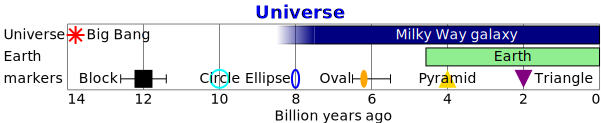
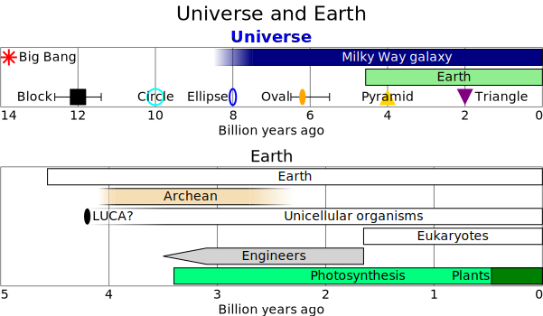

# timelines

## Examples

### universe



```yaml
neogram: 0.7.10
timelines:
  title:
    text: Universe
    size: 18
    bold: true
    color: purple
  entries:
  - event:
      label: Big Bang
      timeline: Universe
      color: red
      instant: -13787000000
  - period:
      label: Milky Way galaxy
      timeline: Universe
      color: navy
      begin: -8000000000
      end: 0
  - period:
      label: Earth
      color: lightgreen
      begin: -4567000000
      end: 0
  - event:
      label: Here
      timeline: markers
      instant: -12000000000
      marker: none
  - event:
      label: Circle
      timeline: markers
      color: cyan
      instant: -10000000000
      marker: circle
      placement: left
  - event:
      label: Ellipse
      timeline: markers
      color: blue
      instant: -8000000000
      placement: left
  - event:
      label: ''
      timeline: markers
      color: orange
      instant: -6000000000
      marker: square
  - event:
      label: Pyramid
      timeline: markers
      color: gold
      instant: -4000000000
      marker: pyramid
      placement: center
  - event:
      label: Triangle
      timeline: markers
      color: purple
      instant: -2000000000
      marker: triangle
  legend: false
```
### earth


```yaml
neogram: 0.7.10
timelines:
  title: Earth
  entries:
  - period:
      label: Earth
      begin: -4567000000
      end: 0
  - event:
      label: LUCA?
      timeline: Encelliga
      instant: -4200000000
  - period:
      label: Unicellular organisms
      timeline: Unicellular
      begin: -3480000000
      end: 0
  - period:
      label: Eukaryotes
      begin: -1650000000
      end: 0
  - period:
      label: Photosynthesis
      begin: -3400000000
      end: 0
  - period:
      label: Plants
      timeline: Photosynthesis
      begin: -470000000
      end: 0
```
### universe_earth



```yaml
neogram: 0.7.10
column:
  title: Universe and Earth
  entries:
  - timelines:
      title:
        text: Universe
        size: 18
        bold: true
        color: purple
      entries:
      - event:
          label: Big Bang
          timeline: Universe
          color: red
          instant: -13787000000
      - period:
          label: Milky Way galaxy
          timeline: Universe
          color: navy
          begin: -8000000000
          end: 0
      - period:
          label: Earth
          color: lightgreen
          begin: -4567000000
          end: 0
      - event:
          label: Here
          timeline: markers
          instant: -12000000000
          marker: none
      - event:
          label: Circle
          timeline: markers
          color: cyan
          instant: -10000000000
          marker: circle
          placement: left
      - event:
          label: Ellipse
          timeline: markers
          color: blue
          instant: -8000000000
          placement: left
      - event:
          label: ''
          timeline: markers
          color: orange
          instant: -6000000000
          marker: square
      - event:
          label: Pyramid
          timeline: markers
          color: gold
          instant: -4000000000
          marker: pyramid
          placement: center
      - event:
          label: Triangle
          timeline: markers
          color: purple
          instant: -2000000000
          marker: triangle
  - timelines:
      title: Earth
      entries:
      - period:
          label: Earth
          begin: -4567000000
          end: 0
      - event:
          label: LUCA?
          timeline: Encelliga
          instant: -4200000000
      - period:
          label: Unicellular organisms
          timeline: Unicellular
          begin: -3480000000
          end: 0
      - period:
          label: Eukaryotes
          begin: -1650000000
          end: 0
      - period:
          label: Photosynthesis
          begin: -3400000000
          end: 0
      - period:
          label: Plants
          timeline: Photosynthesis
          begin: -470000000
          end: 0
```
## Specification
Timelines having events and periods.

- **title**: Title of the timelines diagram.
  - Alternative 1: Text with default styling.
    - *type*: string
  - Alternative 2: Text with styling options.
    - *type*: mapping
    - **text**: The text to display.
      - *required*
      - *type*: string
    - **size**: Size of font.
      - *type*: float
      - *exclusiveMinimum*: 0
    - **bold**: Bold font.
      - *type*: boolean
      - *default*: false
    - **italic**: Italics font.
      - *type*: boolean
      - *default*: false
    - **color**: Color of text.
      - *type*: string
      - *format*: color
      - *default*: 'black'
    - **anchor**: Anchor of text.
      - *one of*: 'start', 'middle', 'end'
      - *default*: 'middle'
- **width**: Width of chart, in pixels.
  - *type*: float
  - *exclusiveMinimum*: 0
  - *default*: 600
- **legend**: Display legend.
  - *type*: boolean
  - *default*: true
- **entries**: Entries in the timelines.
  - *type*: sequence
  - *items*:
    - Option 1
      - *type*: mapping
      - **event**: Event at an instant in time.
        - *type*: mapping
        - **label**: Description of the event.
          - *required*
          - *type*: string
        - **instant**: Time of the event.
          - *required*
          - *type*: float
        - **timeline**: Timeline to place the event in.
          - *type*: string
        - **marker**: Marker for event.
          - *one of*: 'circle', 'ellipse', 'square', 'pyramid', 'triangle', 'none'
          - *default*: 'ellipse'
        - **color**: Color of the event marker.
          - *type*: string
          - *format*: color
          - *default*: 'black'
        - **placement**: Placement of event label.
          - *one of*: 'left', 'center', 'right'
    - Option 2
      - *type*: mapping
      - **period**: Period of time.
        - *type*: mapping
        - **label**: Description of the period.
          - *required*
          - *type*: string
        - **begin**: Starting time of the period.
          - *required*
          - *type*: float
        - **end**: Ending tile of the period.
          - *required*
          - *type*: float
        - **timeline**: Timeline to place the period in.
          - *type*: string
        - **color**: Color of the period graphic.
          - *type*: string
          - *format*: color
          - *default*: 'white'

